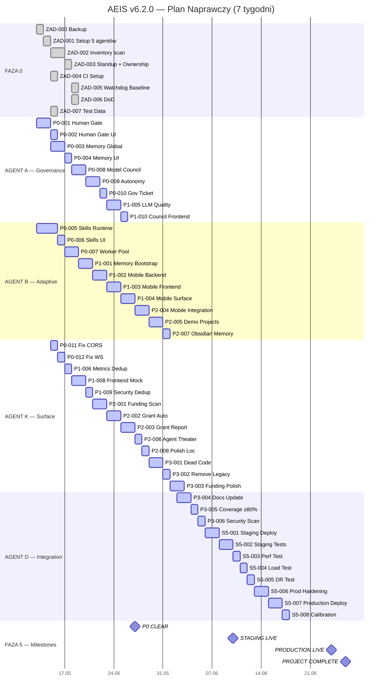

# AEIS v6.2.0 — DIAGRAM GANTT I HARMONOGRAM

**Czas całkowity:** 7 tygodni (288h)  
**Zespoły:** 5 agentów równoległych (A/B/K/D/E)  
**Start:** T+0  
**Koniec:** T+49 dni

---

## 1. DIAGRAM GANTT — ASCII

```
AGENT / TYDZIEŃ ->   1        2        3        4        5        6        7
                  [||||||||][||||||||][||||||||][||||||||][||||||||][||||||||][||||||||]

AGENT A (Governance)
  P0-001 Human Gate      [=======]
  P0-003 Memory          [=======]
  P0-008 Model Council   [=======]
  P0-009 Autonomy        [=======]
  P0-010 Gov Ticket      [====]
  P1-005 LLM Quality            [=======]
  P1-010 Council UI                    [====]

AGENT B (Adaptive + Mobile)
  P0-005 Skills Runtime  [==========]
  P0-007 Worker Pool       [======]
  P1-001 Memory Bootstrap       [======]
  P1-002 Mobile Backend              [========]
  P1-003 Mobile Frontend              [======]
  P1-004 Mobile Surface                    [======]
  P2-004 Mobile Runtime                           [========]
  P2-005 Demo Projects                            [======]
  P2-007 Obsidian Memory                               [====]

AGENT K (Surface + Hygiene)
  ZAD-002 Inventory      [====]
  P0-011 Fix CORS          [==]
  P0-012 Fix WS            [==]
  P1-006 Metrics Dedup          [====]
  P1-008 Frontend Mock               [======]
  P1-009 Security Dedup              [====]
  P2-001 Funding Scan                     [========]
  P2-002 Grant Auto                          [========]
  P2-003 Grant Report                             [======]
  P2-006 Agent Theater                              [====]
  P2-008 Polish Loc                                      [====]
  P3-001 Dead Code                                   [========]
  P3-002 Remove Legacy                                   [====]
  P3-003 Funding Polish                                     [======]

AGENT D (Integration)
  ZAD-000 Backup         [==]
  ZAD-001 Setup          [==]
  ZAD-004 CI Setup       [==]
  ZAD-006 DoD            [=]
  ZAD-007 Test Data      [=]
  P3-004 Docs Update                                         [======]
  P3-005 Coverage ≥80%                                       [====]
  P3-006 Security Scan                                       [====]
  S5-001 Staging Deploy                                           [========]
  S5-002 Staging Tests                                            [========]
  S5-003 Perf Test                                                    [====]
  S5-004 Load Test                                                    [====]
  S5-005 DR Test                                                      [====]
  S5-006 Prod Harden                                                  [========]
  S5-007 Production Deploy                                                 [========]
  S5-008 Calibration                                                            [====]

AGENT E (Watchdog)
  ZAD-005 Baseline       [==]
  Daily Cycles           [W][W][W][W][W][W][W][W][W][W][W][W][W][W][W][W][W][W][W][W][W][W][W][W][W][W][W][W][W][W][W][W][W][W][W][W][W][W][W][W][W][W][W][W][W][W][W][W][W]
```

**Legenda:** `[====]` = aktywność agenta w danym tygodniu | `W` = cykl Watchdog (co 4-6h)

---

## 2. DIAGRAM GANTT — MERMAID



---

## 3. HARMONOGRAM TYGODNIOWY

| Tydzień | Od | Do | Faza | Zespoły | Kluczowe cele |
|---------|-----|-----|------|---------|---------------|
| **1** | 13.05 | 19.05 | F0 + P0 start | D, K, A | Backup, setup 5 agentów, inventory, Human Gate start |
| **2** | 20.05 | 26.05 | P0 Blockers | A, B | Memory, Skills, Worker pool, Council — **P0 CLEAR** |
| **3** | 27.05 | 02.06 | P0 finisz + P1 | A, B, K | Autonomy, Gov ticket, Mobile backend, Metrics dedup |
| **4** | 03.06 | 09.06 | P1 + P2 | B, K | Mobile frontend, Decomposition, Funding scan, Agent Theater |
| **5** | 10.06 | 16.06 | P2 + P3 | K, B | Polish loc, Demo projects, Dead code, Remove legacy |
| **6** | 17.06 | 23.06 | P3 + Staging | K, D | Docs, coverage ≥80%, security scan, **STAGING LIVE** |
| **7** | 24.06 | 30.06 | Production | D, E | Load test, DR test, hardening, canary, **PRODUCTION LIVE** |

---

## 4. KRZYŻOWANIE ZALEŻNOŚCI

```
P0-001 (Human Gate) ───┬───> P0-002 (HG UI)
                       ├───> P0-010 (Gov Ticket)
                       └───> P1-002 (Mobile Backend)

P0-003 (Memory) ───────┬───> P0-004 (Memory UI)
                       ├───> P1-001 (Memory Bootstrap)
                       └───> P0-009 (Autonomy)

P0-005 (Skills) ───────┬───> P0-006 (Skills UI)
                       └───> P1-007 (Decomposition)

P0-008 (Council) ──────┬───> P0-009 (Autonomy)
                       └───> P1-010 (Council UI)

P1-002 (Mobile BE) ────┬───> P1-003 (Mobile FE)
                       └───> P1-004 (Mobile Surface)
                       └───> P2-004 (Mobile Runtime)

P0-011 (CORS) ─────────> P1-008 (Frontend Mock)
P0-012 (WS) ───────────> P1-008 (Frontend Mock)

P2-001 (Funding) ──────> P2-002 (Grant Auto)
P2-002 (Grant Auto) ───> P2-003 (Grant Report)

P3-001 (Dead Code) ────> P3-002 (Remove Legacy)
P3-002 (Legacy) ───────> P3-004 (Docs)

S5-001 (Staging) ──────┬───> S5-002 (Staging Tests)
S5-002 (Tests) ────────┬───> S5-003 (Perf)
                       ├───> S5-004 (Load)
                       ├───> S5-005 (DR)
                       └───> S5-006 (Hardening)
S5-006 (Harden) ───────> S5-007 (Production)
S5-007 (Prod) ─────────> S5-008 (Calibration)
```

---

## 5. MAPA CIEPLNA — OBCIĄŻENIE AGENTÓW

```
         Tydzień 1    Tydzień 2    Tydzień 3    Tydzień 4    Tydzień 5    Tydzień 6    Tydzień 7
         ████████     ████████     ████████     ████████     ████████     ████████     ████████

AGENT A  ████████     ██████████   ████████     ████         ░░░░░░░░     ░░░░░░░░     ░░░░░░░░
         F0+P0        P0           P0+P1        P1           idle         idle         standby

AGENT B  ████████     ████████     ████████     ██████████   ████████     ░░░░░░░░     ░░░░░░░░
         F0+P0        P0           P0+P1        P1+P2        P2           idle         standby

AGENT K  ████████     ████████     ████████     ████████     ██████████   ████████     ░░░░░░░░
         F0+P0        P0           P1           P1+P2        P2+P3        P3           standby

AGENT D  ██████████   ░░░░░░░░     ░░░░░░░░     ░░░░░░░░     ░░░░░░░░     ████████     ██████████
         F0 setup     idle         idle         idle         idle         P3+Staging   Production

AGENT E  ██           ██           ██           ██           ██           ██           ██
         Watchdog     Watchdog     Watchdog     Watchdog     Watchdog     Watchdog     Watchdog

Legenda: ████ = praca  |  ░░░░ = idle/standby  |  ██ = Watchdog cycle (4-6h)
```

---

## 6. TIMELINE — MILESTONES

```
T+0  (13.05)  ████ START — Faza 0: Backup, Setup, Inventory
T+7  (20.05)  ████ Milestone: Faza 0 Complete
              ████ P0 START — Human Gate, Memory, Skills, Worker Pool

T+14 (27.05)  ████ Milestone: P0 CLEAR — 8/8 blockers naprawionych
              ████ P1 START — Mobile, Decomposition, Council, Frontend

T+21 (03.06)  ████ P2 START — Funding scan, Agent Theater, Demo projects

T+28 (10.06)  ████ P3 START — Cleanup, docs, tests, security scan

T+35 (17.06)  ████ Milestone: STAGING LIVE
              ████ S5 START — Load test, DR, hardening

T+42 (24.06)  ████ Milestone: PRODUCTION LIVE — Canary deploy
              ████ 24h observation period

T+49 (01.07)  ████ Milestone: PROJECT COMPLETE
              ████ Calibration, handoff, warranty start
```

---

*Generated 2026-05-12 | AEIS v6.2.0 Repair Plan | Kimi Code CLI*
