# AEIS - pelna dokumentacja systemu 2026

Data: 2026-05-18
Zakres: runtime lokalny AEIS 3.5.0, frontend Next.js, backend FastAPI, dashboard operatorski, projektowy lifecycle, funding, test center, orchestration, memory, skills, Human Gate i warstwa W1-W19.
Status dokumentacji: wersja 1.1, oparta o kod, OpenAPI, runtime health, screenshoty, retest dashboardowy P1-P4 i roadmapa produkcyjna 2026-05-18.

## Spis tresci

1. [Jak czytac dokumentacje](#jak-czytac-dokumentacje)
2. [Pakiet dokumentacji](#pakiet-dokumentacji)
3. [Najwazniejsze fakty runtime](#najwazniejsze-fakty-runtime)
4. [Galeria screenshotow](#galeria-screenshotow)
5. [Mapa systemu](#mapa-systemu)
6. [Statusy i legenda](#statusy-i-legenda)
7. [Zasada testowania i zamrazania](#zasada-testowania-i-zamrazania)
8. [Zrodla dowodowe](#zrodla-dowodowe)

## Jak czytac dokumentacje

Ta dokumentacja rozdziela trzy rzeczy:

- fakt runtime: cos dziala w uruchomionym backendzie, frontendzie albo API;
- fakt kodowy: modul istnieje i jest podpiety w repo;
- plan docelowy: architektura, ktora wynika z checklisty production-ready, ale nie musi byc jeszcze w pelni zamknieta.

Jezeli jakas funkcja ma route, ale brak pelnego testu akcji, jest opisana jako `ROUTE_ONLY`, `PARTIAL` albo `API_ONLY`. Jezeli przeszla klikany flow dashboardowy, reload proof i drugi pass, jest oznaczona jako `2X_PASS`.

## Pakiet dokumentacji

| Plik | Co zawiera |
| --- | --- |
| [01_START_I_ARCHITEKTURA.md](01_START_I_ARCHITEKTURA.md) | Pierwsze uruchomienie, topologia runtime, warstwy W1-W19, source of truth, mapa zaleznosci. |
| [02_MODULY_API_UI.md](02_MODULY_API_UI.md) | Modul po module: backend packages, API families, frontend routes, menu operatora, statusy powierzchni. |
| [03_PROJEKTY_FAZY_TUTORIAL.md](03_PROJEKTY_FAZY_TUTORIAL.md) | Tutorial tworzenia projektu, fazy 16-41, cztery projekty probne od latwego do trudnego. |
| [04_KONFIG_ORCHESTRACJA_TESTY.md](04_KONFIG_ORCHESTRACJA_TESTY.md) | Konfiguracja, model council, orchestration J1-J9, skills, memory, test center, freeze policy. |
| [05_FUNDING_MOBILE_HELPTIPS.md](05_FUNDING_MOBILE_HELPTIPS.md) | Funding end-to-end, mobile operator, HelpTipy, legenda zakladek i funkcji. |
| [06_ROADMAP_PRODUKCYJNA.md](06_ROADMAP_PRODUKCYJNA.md) | Roadmapa brakow, napraw, zmian i testow wymaganych do statusu production ready. |
| [screenshots/](screenshots/) | Screenshoty z dzialajacego systemu wykonane 2026-05-17. |

## Najwazniejsze fakty runtime

| Element | Wartosc |
| --- | --- |
| Backend lokalny | `http://127.0.0.1:8010` |
| Frontend lokalny testowy | `http://127.0.0.1:3002` |
| Health | `status=ok` |
| Version | `3.5.0` |
| Runtime modules | `138` |
| Runtime endpoints wedlug `/health` | `1961` |
| OpenAPI path templates | `1649` |
| OpenAPI methods policzone z paths | `1932` |
| DB mode | `sqlite` |
| Event mode | `sqlite` |
| Frontend route pages | `129` |
| Backend route files `*_routes.py` | `127` |

## Galeria screenshotow

| Ekran | Route | Screenshot |
| --- | --- | --- |
| Przeglad | `/overview` | 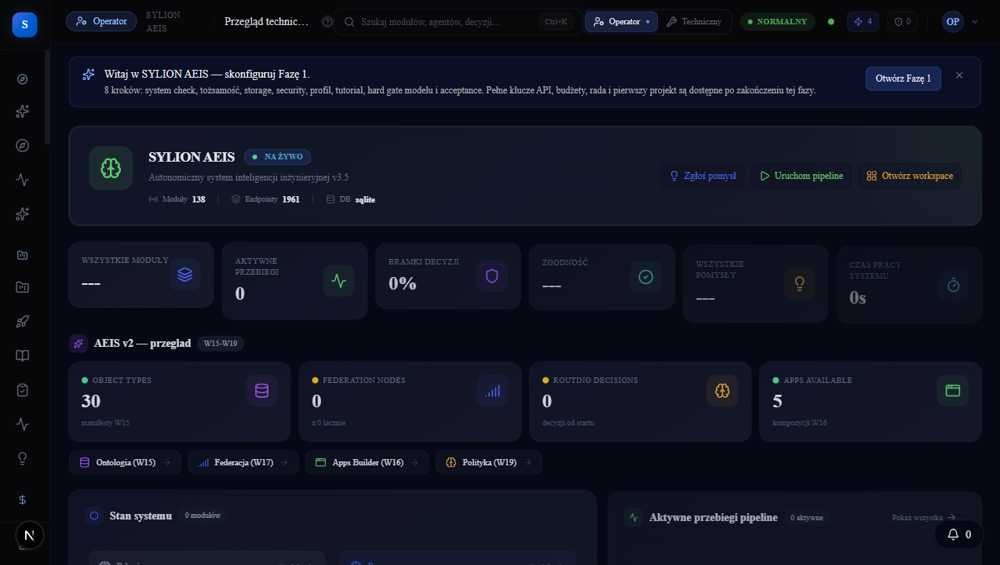 |
| Start projektu | `/project-start` | 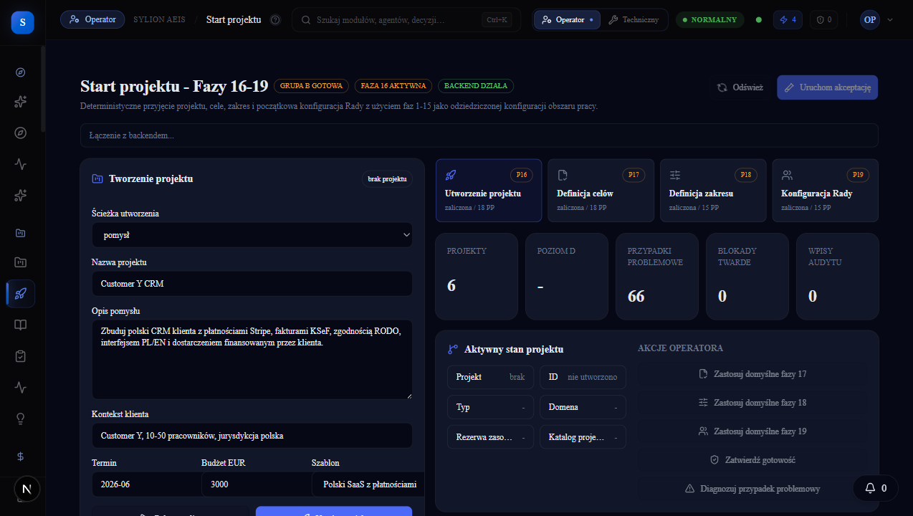 |
| Deliberacja i Ksiega | `/council-to-ksiega` | 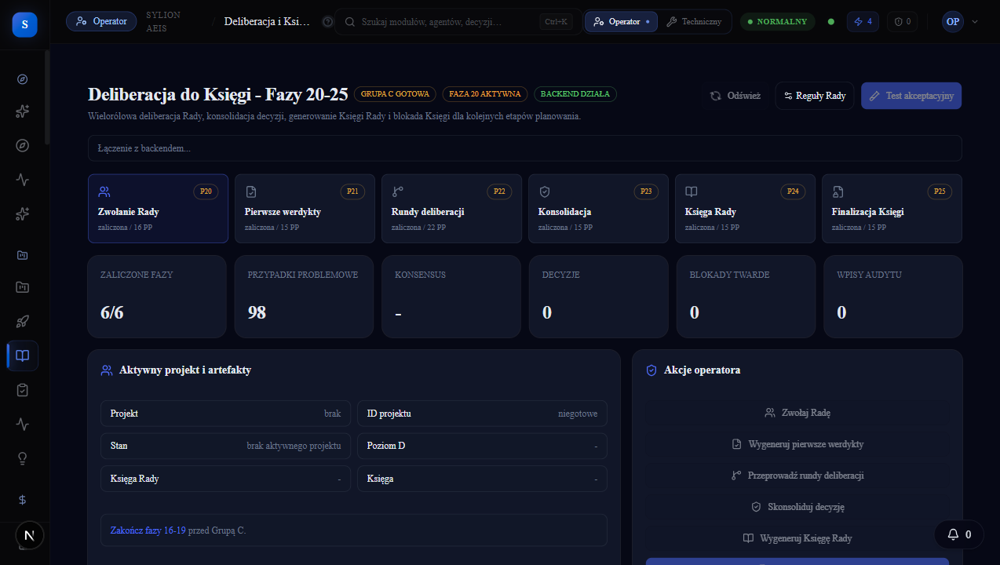 |
| Planowanie | `/planning` | 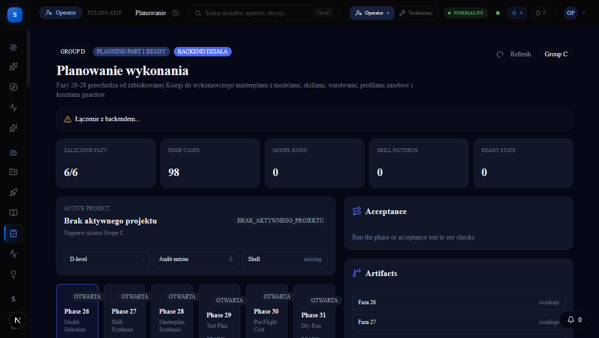 |
| Start wykonania | `/execution-start` | 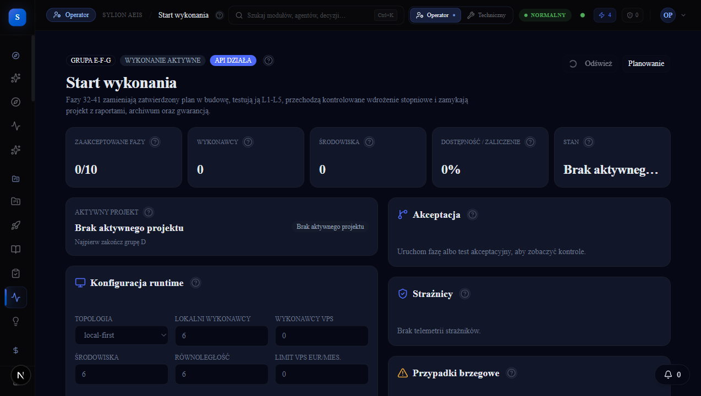 |
| Funding | `/funding` | 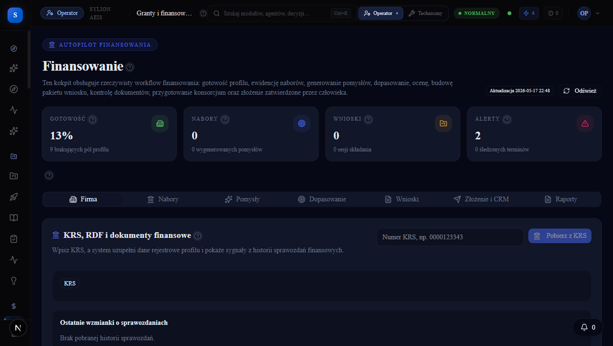 |
| Test Center | `/test-center/dashboard` | 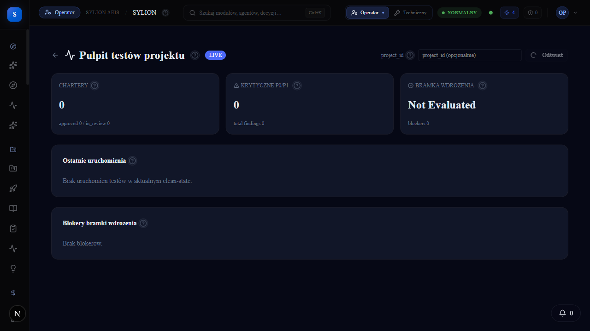 |
| Human Gate | `/human-gate` | 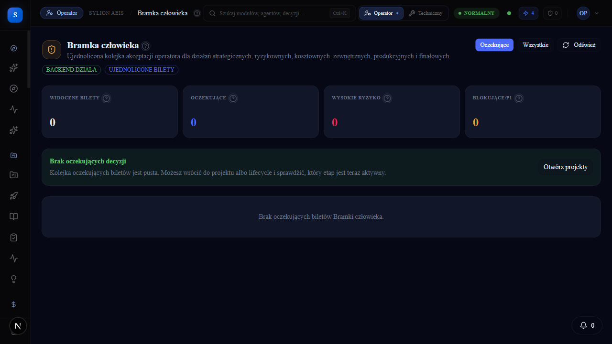 |
| Orchestration | `/orchestration` | 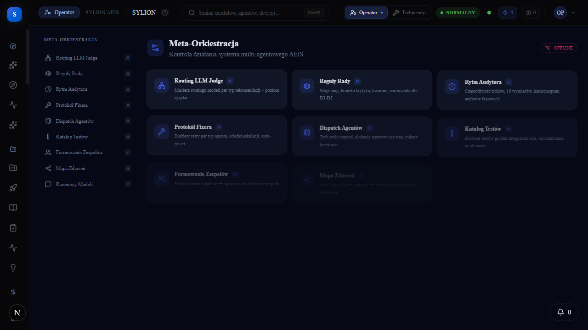 |
| Operator mobile queue | `/operator-mobile/queue` | 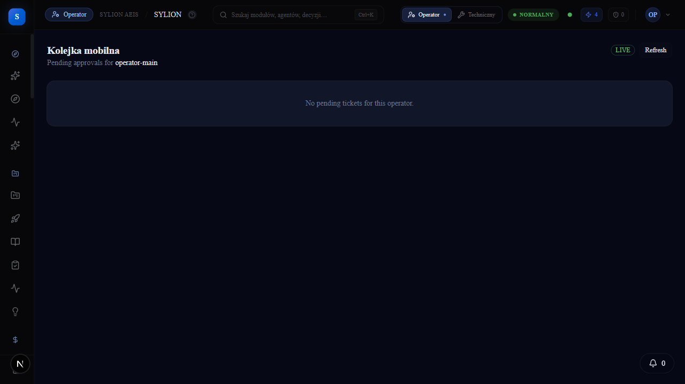 |
| Workspace | `/workspace` | 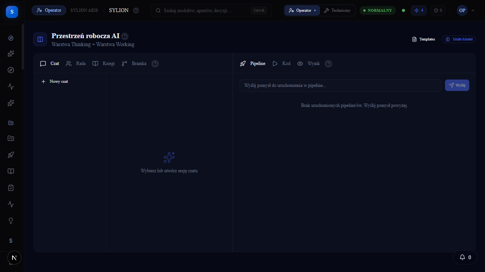 |
| Model Council | `/model-council` | 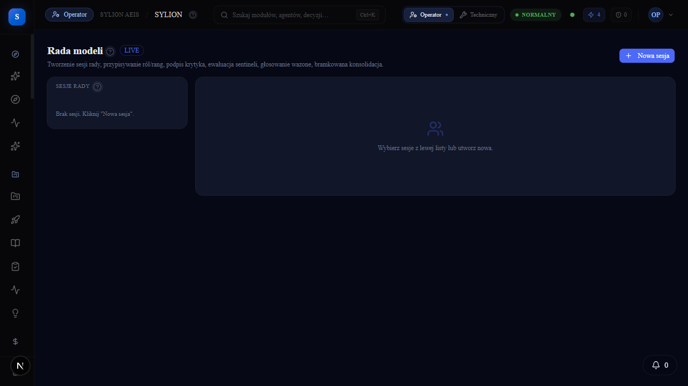 |
| Skills | `/skills` | 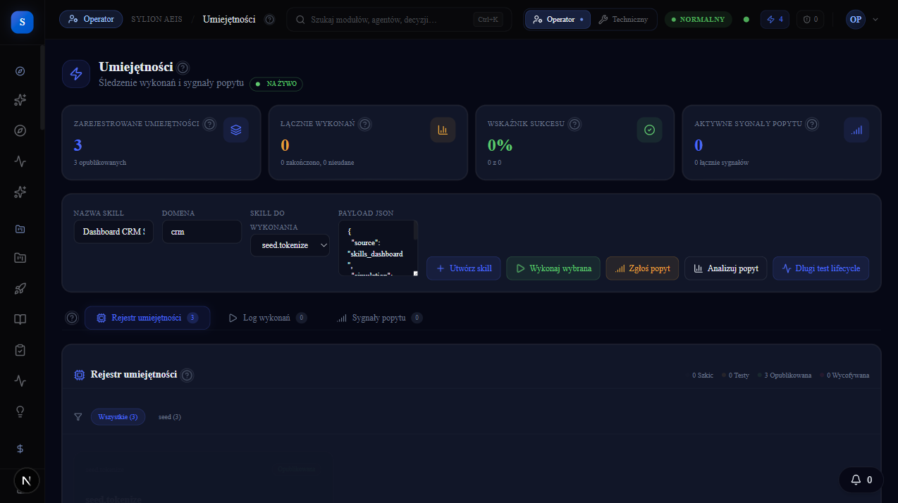 |
| Memory | `/memory` | 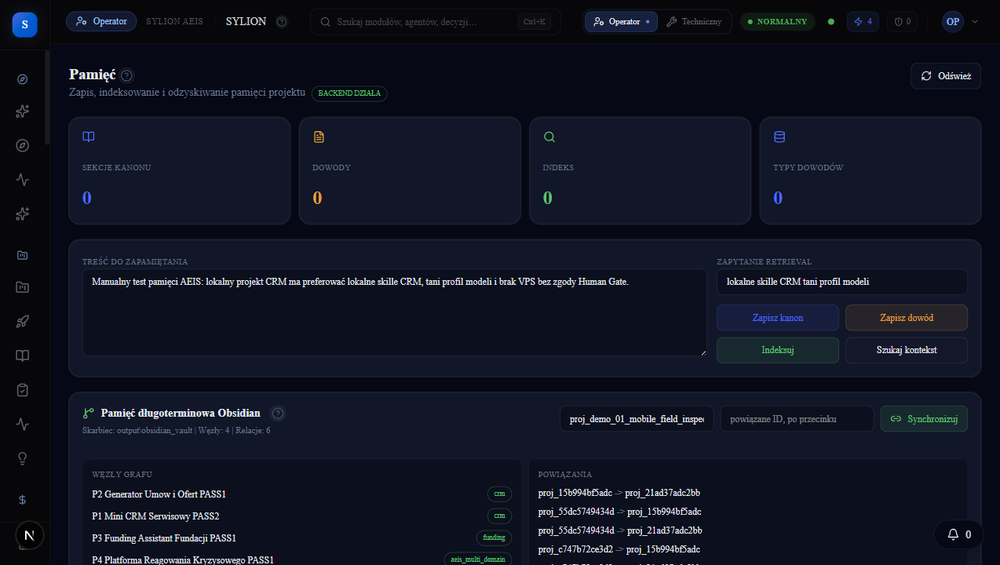 |

## Mapa systemu

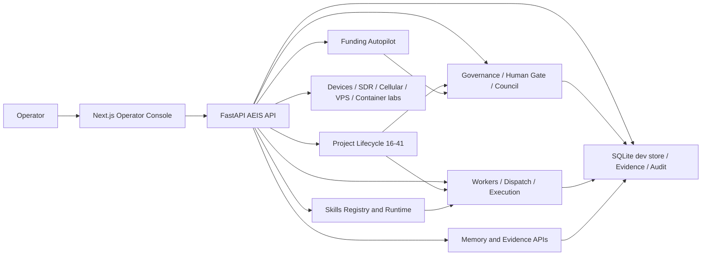

## Statusy i legenda

| Status | Znaczenie |
| --- | --- |
| `LIVE_VERIFIED` | Modul ma kod i runtime/API/UI potwierdzaja dzialanie. |
| `2X_PASS` | Flow przeszedl dwa razy z dowodem UI/API/reload. |
| `PARTIAL` | Funkcja istnieje, ale nie jest domknieta end-to-end. |
| `ROUTE_ONLY` | Strona renderuje, ale akcje nie maja pelnego freeze. |
| `API_ONLY` | Endpointy dzialaja, ale brak kompletnej powierzchni UI. |
| `UI_ONLY` | UI istnieje bez potwierdzonego backendu. |
| `LEGACY` | Element historyczny albo pomocniczy, nie glowny source of truth. |
| `PLANNED` | Plan docelowy bez wystarczajacego runtime. |
| `BROKEN` | Kod lub UI istnieje, ale test/runtime przeczy oczekiwanemu zachowaniu. |

## Zasada testowania i zamrazania

Komenda operatorska obowiazujaca dla dalszych testow:

```text
Kazdy blad zatrzymuje flow. Najpierw napraw przyczyne, potem wykonaj dwa retesty.
Jezeli oba retesty przejda, zapisz evidence, oznacz flow jako frozen i dopiero wtedy idz dalej.
Toast, sam route albo sam status 200 nie wystarcza. Wymagane sa: efekt UI, efekt API, reload proof i brak bledow konsoli.
```

Ta zasada zostala zastosowana w retestach:

- P1 Mini CRM Serwisowy - easy;
- P2 Generator Umow i Ofert - medium;
- P3 Funding Assistant Fundacji - hard;
- P4 Platforma Reagowania Kryzysowego - very hard.

Pelny rejestr: [../aeis_manual_tests/12_HUMAN_DASHBOARD_RETEST_2026_05_17.md](../aeis_manual_tests/12_HUMAN_DASHBOARD_RETEST_2026_05_17.md).

## Zrodla dowodowe

| Zrodlo | Co potwierdza |
| --- | --- |
| `/health` backendu | Wersja, liczba modulow, liczba endpointow, tryb DB/event. |
| `/openapi.json` | Rodziny API, path templates, metody. |
| `src/sylion-pipeline/sylion/api` | Routery FastAPI i control planes. |
| `src/sylion-frontend/src/app/(app)` | Trasy dashboardu operatorskiego i technicznego. |
| `src/sylion-frontend/src/components/layout/AppSidebar.tsx` | Menu, sekcje i legenda zakladek. |
| `src/sylion-frontend/src/components/common/HelpTip.tsx` | Wspolny mechanizm dymkow pomocy. |
| `docs/aeis_manual_tests/12_HUMAN_DASHBOARD_RETEST_2026_05_17.md` | Ostatni klikany retest P1-P4. |
| `docs/aeis_repair_v2/*` | Historyczne freeze packi, run logi i bug ledgery. |
