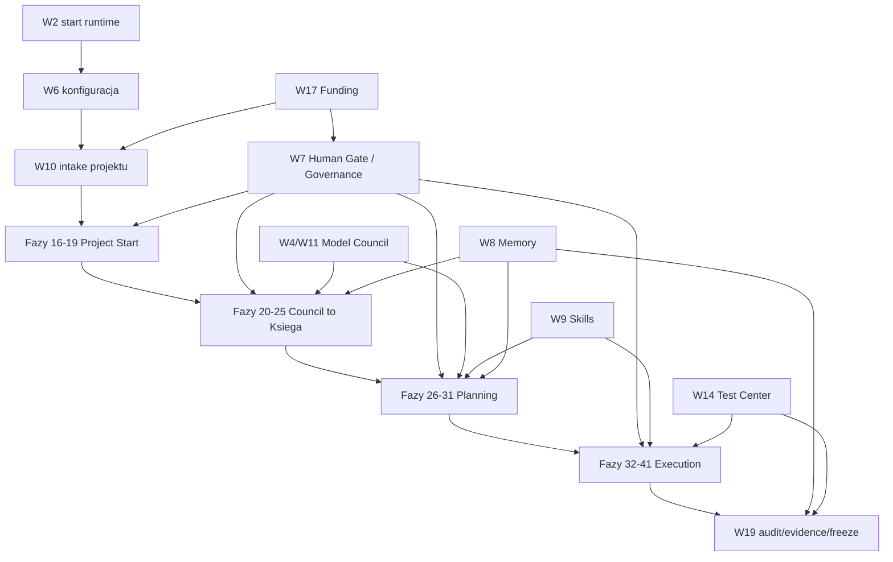

# Start, runtime i architektura AEIS

## Spis tresci

1. [Pierwsze uruchomienie](#pierwsze-uruchomienie)
2. [Szybka weryfikacja po starcie](#szybka-weryfikacja-po-starcie)
3. [Topologia runtime](#topologia-runtime)
4. [Warstwy W1-W19](#warstwy-w1-w19)
5. [Source of truth i przeplyw danych](#source-of-truth-i-przeplyw-danych)
6. [Mapa zaleznosci](#mapa-zaleznosci)
7. [Tryby uruchomienia](#tryby-uruchomienia)
8. [Granice produkcyjne](#granice-produkcyjne)

## Pierwsze uruchomienie

Minimalny start lokalny:

```powershell
.\scripts\install.ps1
.\scripts\start-server.ps1
.\start_frontend.ps1
```

Co robi instalator:

- wymaga Python `3.11+`;
- tworzy `.venv`, jezeli brakuje srodowiska;
- instaluje zaleznosci z `requirements.txt`, `requirements-lock.txt` albo `requirements-pg.txt`;
- tworzy `.env.generated`, jezeli plik nie istnieje;
- generuje lokalne sekrety dev: `SYLION_JWT_SECRET`, `SYLION_INTERNAL_API_KEY`, `SYLION_VAULT_SECRET`.

Co robi backend start:

- ustawia `SYLION_DB_PATH=sylion_aeis.db`;
- ustawia `SYLION_ENV=development`;
- ustawia `PYTHONPATH=src\sylion-pipeline`;
- uruchamia `uvicorn sylion.api.app:app --host 127.0.0.1 --port 8010`.

Co robi frontend start:

- wchodzi do `src/sylion-frontend`;
- uruchamia `npm run dev`;
- korzysta z rewrite w `next.config.ts`, jezeli `NEXT_PUBLIC_API_URL` jest puste;
- w testach dokumentacyjnych dzialal z jawnie ustawionym `NEXT_PUBLIC_API_URL=http://127.0.0.1:8010`.

## Szybka weryfikacja po starcie

```powershell
Invoke-RestMethod http://127.0.0.1:8010/health
Invoke-RestMethod http://127.0.0.1:8010/openapi.json
npm run build
```

Oczekiwany health w tej dokumentacji:

```json
{
  "status": "ok",
  "version": "3.5.0",
  "modules": 138,
  "endpoints": 1961,
  "db_mode": "sqlite",
  "event_mode": "sqlite"
}
```

Ostatni build produkcyjny frontendu:

- `npm run build` w `src/sylion-frontend`;
- wynik: PASS;
- `125/125` stron statycznych wygenerowanych.

## Topologia runtime

| Warstwa | Technologia | Rola |
| --- | --- | --- |
| Operator UI | Next.js 16, React, Tailwind-style classes, lucide icons | Dashboard operatora, dashboard techniczny, projekt lifecycle, funding, test center. |
| API | FastAPI | Jeden runtime HTTP agregujacy moduly AEIS. |
| Orchestration | Python services + API routes | Routing modeli, council, dispatch, worker registry, repair/test loops. |
| Storage dev | SQLite | Lokalny stan projektow, funding, audit, events, memory fragments. |
| Storage prod target | PostgreSQL + backup + vault | Docelowy production-ready kierunek z checklisty. |
| Evidence | Markdown, JSON, screenshoty, audit ledgers | Zamrozenia testow, bug ledgery, run logi, artefakty projektow. |
| Workers | Python worker registry/runtime | Rejestracja, heartbeat, dispatch, rebalance, local smoke workers. |
| Labs | devices, SDR, cellular, VPS, container | Eksperymentalne moduly runtime i infrastruktury. |

## Warstwy W1-W19

| W | Nazwa | Odpowiedzialnosc | Glowna powierzchnia |
| --- | --- | --- | --- |
| W1 | Kanon i polityki | Zasady systemowe, granice, dokumenty kanoniczne. | `/policy`, `/book`, docs |
| W2 | Bootstrap | Instalacja, health, start runtime. | `/health`, scripts |
| W3 | Tozsamosc i role | Operator, role, uprawnienia, profile. | `/auth`, `/roles`, `/settings/profile` |
| W4 | Modele i providerzy | Provider catalog, model registry, budget. | `/ai-models`, `/budget`, `/secrets` |
| W5 | Infrastruktura | Runtime, environments, deploy, VPS, container. | `/environments`, `/runtime`, `/deploy` |
| W6 | Defaulty | Workspace defaults, autonomia, guard defaults. | `/workspace-defaults`, `/autonomy` |
| W7 | Governance | Human Gate, D0-D5, rada, gates. | `/human-gate`, `/governance`, `/gates` |
| W8 | Memory | Wiedza, kanon, evidence, retrieval. | `/memory`, `/source-of-truth` |
| W9 | Skills | Registry, executor, demand signals. | `/skills` |
| W10 | Intake | Pomysly, project-start, pipeline. | `/workspace`, `/project-start`, `/idea-vault` |
| W11 | Model Council | Role rady, quorum, glosowanie, rozmowy AI. | `/model-council`, `/orchestration/council-rules` |
| W12 | Ksiega i truth | Council to Ksiega, freeze canon/masterplan. | `/council-to-ksiega`, `/evidence-spine` |
| W13 | Advisor i masterplan | Doradca, rekomendacje, planning. | `/advisor`, `/planning` |
| W14 | Testy | Test center, golden tests, release gates. | `/test-center`, `/golden-tests` |
| W15 | Ontologia | Obiekty domenowe, kontrakty, typy. | `/ontology`, `/contracts`, `/role-catalog` |
| W16 | Execution | Workerzy, build, dispatch, artefakty. | `/execution-start`, `/workers`, `/apps-builder` |
| W17 | Integracje i funding | Funding, devices, federation, labs. | `/funding`, `/devices`, `/federation` |
| W18 | Terminal | Komendy, replay, ownership, rollback. | `/terminal`, `/terminal/replay` |
| W19 | Audit i ewolucja | Audit trail, freeze, drift, repair backlog. | `/audit`, `/drift`, `/rebuild` |

## Source of truth i przeplyw danych

AEIS nie ma jeszcze jednego globalnego source-of-truth w stylu produkcyjnego MemoryPlane. W runtime dev prawda jest federacyjna:

- API state w SQLite;
- project lifecycle state;
- audit chain projektu;
- freeze register;
- screenshoty;
- JSON/Markdown evidence;
- OpenAPI jako kontrakt runtime;
- dokumenty napraw i retestow.

Docelowa regola production-ready:

```text
Write idzie przez centralny plane domenowy.
Read view moze byc materialized view albo replica.
Kazdy artefakt ma provenance, checksum, retention policy i evidence_id.
Kazda decyzja D3+ ma Human Gate albo Council evidence.
```

## Mapa zaleznosci



## Tryby uruchomienia

| Tryb | Komenda / plik | Zastosowanie |
| --- | --- | --- |
| Root API dev | `.\scripts\start-server.ps1` | Domyslny lokalny backend AEIS. |
| Frontend dev | `.\start_frontend.ps1` | Next.js operator console. |
| Standalone legacy dashboard | `python dashboard/start.py` | Starszy dashboard Python, pomocniczy/legacy. |
| Docker dashboard stack | `src/sylion-pipeline/docker-compose.yml` | Dashboard + Redis + Caddy + Prometheus/Grafana. |
| Full API stack | `src/sylion-pipeline/docker-compose.full.yml` | PostgreSQL + NATS + API. |
| PostgreSQL-only stack | `src/sylion-pipeline/docker-compose.pg.yml` | API z PostgreSQL bez NATS. |
| Dev overlay | `src/sylion-pipeline/docker-compose.dev.yml` | Lokalny overlay z MailHog/Adminer/Redis. |

## Granice produkcyjne

Aktualny runtime dokumentowany tutaj jest lokalny/dev-staging. Najwazniejsze granice przed produkcja:

- PostgreSQL powinien byc wymagany dla staging/production;
- SQLite powinien zostac tylko w development;
- vault powinien zastapic plaintext secrets;
- Human Gate powinien byc jednym globalnym plane;
- Memory powinno miec jeden write plane;
- global deploy pipeline musi miec canary, rollback i DR drill;
- mobile approval wymaga device binding, push i non-repudiation;
- route-only pages musza miec backend action freeze.
