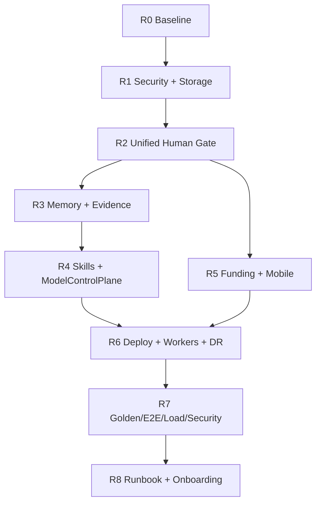

# Roadmapa produkcyjna AEIS 2026

Data: 2026-05-18

Status wyjsciowy: `LOCAL_W14_ACCEPTANCE_PASS / DEV-STAGING CAPABLE / NOT PRODUCTION READY`

Cel: doprowadzic AEIS do wersji produkcyjnej bez przepisywania systemu od zera. Roadmapa zaklada konsolidacje istniejacych planes, domkniecie luk runtime, twardy hardening oraz testy prowadzone przez dashboard tak, jak robi to realny operator.

## Spis tresci

1. [Werdykt startowy](#werdykt-startowy)
2. [Zasady nienegocjowalne](#zasady-nienegocjowalne)
3. [Mapa brakow produkcyjnych](#mapa-brakow-produkcyjnych)
4. [Roadmapa faz R0-R8](#roadmapa-faz-r0-r8)
5. [Backlog wykonawczy P0-P3](#backlog-wykonawczy-p0-p3)
6. [Testy akceptacyjne dashboardem](#testy-akceptacyjne-dashboardem)
7. [Zaleznosci architektoniczne](#zaleznosci-architektoniczne)
8. [Kryterium Production Ready](#kryterium-production-ready)

## Werdykt startowy

AEIS ma dzialajacy lokalny runtime, dashboard operatorski, bogaty backend FastAPI, projektowy lifecycle, funding, test center, workers, skills, memory, Human Gate i liczne moduly laboratoryjne.

To nie jest jeszcze production-ready, poniewaz kluczowe planes sa nadal pofragmentowane:

- storage produkcyjny nie jest wymuszony jako PostgreSQL;
- sekrety, backup, DR, rate limiting i secure headers nie sa zamkniete jako twardy standard;
- Human Gate istnieje w kilku planes zamiast jednej prawdy decyzji;
- funding ma lokalny approval flow, a nie jednolity globalny ticket governance;
- memory, evidence i per-project runtime DB nie tworza jednego write plane;
- skills registry, executor i demand signal nie sa w pelni podpiete pod pipeline i execution;
- provider registry, model registry, council settings i routing modeli sa nadal osobnymi planes;
- deployment produkcyjny ma rehearsal, ale wymaga pelnego cloud rollout, canary, rollback i DR drill;
- route-only powierzchnie dashboardu wymagaja zamrozenia akcji, nie tylko renderu;
- mobile approval queue wymaga device binding, push i pelnego audytu urzadzenia.

Najuczciwszy stan startowy:

```text
AEIS dziala jako silny system dev-staging i lokalny system testowy.
AEIS nie moze byc oznaczony jako production-ready, dopoki P0 i P1 z tej roadmapy nie przejda 2X_PASS.
```

## Zasady nienegocjowalne

### Zasada 1: Stop, napraw, retestuj, zamrazaj

Komenda operatorska dla wszystkich dalszych prac:

```text
Kazdy blad zatrzymuje flow.
Najpierw napraw przyczyne.
Potem wykonaj dwa pelne retesty tego samego flow.
Jezeli oba retesty przejda, zapisz evidence, oznacz flow jako frozen i dopiero wtedy idz dalej.
Toast, sam route albo sam status 200 nie wystarcza.
Wymagane sa: efekt UI, efekt API, reload proof, audit/evidence i brak bledow konsoli.
```

### Zasada 2: Route-action pair freeze

Kazda strona z akcja mutujaca musi miec:

- backend route `2X_PASS`;
- frontend action `2X_PASS`;
- obsluge bledow `network`, `500`, `403`, `timeout`;
- poprawna obsluge `204 No Content`;
- reload proof po zapisie;
- brak falszywego sukcesu w UI;
- wpis w bug ledger i freeze register.

### Zasada 3: Jeden source of truth dla decyzji

Kazda decyzja D3+ musi przejsc przez unified Human Gate albo formalny Council flow. UI nie moze byc zrodlem prawdy autoryzacji. UI tylko pokazuje stan, a backend egzekwuje decyzje.

### Zasada 4: Produkcja bez SQLite

SQLite zostaje tylko w `development`. `staging` i `production` wymagaja PostgreSQL 16+, migracji, backupu, restore drill i monitoringu polaczen.

### Zasada 5: Evidence albo nie istnieje

Kazda naprawa, test, deploy, rollback, approval, external submit i freeze musi miec:

- `evidence_id`;
- source;
- checksum albo payload hash;
- operator/actor;
- timestamp;
- retention policy;
- link do artefaktu lub screenshotu.

## Mapa brakow produkcyjnych

| Obszar | Stan dzis | Brak produkcyjny | Ryzyko | Priorytet |
| --- | --- | --- | --- | --- |
| Database | SQLite local/dev | PostgreSQL wymagany dla staging/prod, Alembic 2X, PgBouncer | utrata danych, brak concurrency, brak PITR | P0 |
| Backup/DR | brak twardego drill | backup co 6h, restore 2X, RPO/RTO | brak odtworzenia po awarii | P0 |
| Secrets | lokalne sekrety/dev | Vault, rotacja, audit sekretow | wyciek kluczy | P0 |
| RBAC | czesciowo UX/API | backend enforcement na kazdym endpointzie mutujacym | bypass uprawnien | P0 |
| Rate limit | brak globalnego standardu | Redis limiter per role i endpoint | abuse, runaway cost | P0 |
| Secure headers | brak standardu freeze | HSTS, CSP, XFO, scan | ataki webowe | P1 |
| Human Gate | wiele planes | jedna tabela, lifecycle, event sourcing | decyzje rozjezdzaja sie | P0 |
| Funding submit | local gate | D4 global Human Gate, preview, receipt, audit | niechciany finalny submit | P0 |
| Memory | federacyjna prawda | jeden write plane + project views | niespojna wiedza systemu | P1 |
| Evidence | rozproszone artefakty | EvidenceSpine | brak audytu end-to-end | P1 |
| Skills | registry/executor/demand split | pipeline i execution uzywaja skills automatycznie | manualne wywolywanie skills | P1 |
| Model plane | registry/council/routing split | ModelControlPlane + BudgetEnforcer | niespojny routing modeli | P1 |
| Workers | local smoke/live surface | zewnetrzna flota lifecycle 2X | brak realnej skalowalnosci | P1 |
| Autoscaler | route istnieje | CPU/queue/error scale test | flapping albo brak reakcji | P2 |
| Deploy | rehearsal | build, scan, staging, canary, prod, rollback | brak realnego rollout | P0 |
| Testy | local W14 pass | CI golden/e2e/load/security | regresje po zmianach | P1 |
| Mobile | queue surface | device binding, push, mobile audit | brak non-repudiation | P2 |
| Global terminal | partial | actor/env/risk/rollback na kazdej komendzie | akcje bez wlasciciela | P2 |
| Docs/onboarding | obszerne, ale stale rosnace | operator runbook + wizard < 15 min | blad operacyjny | P2 |

## Roadmapa faz R0-R8

### R0: Baseline produkcyjny i kontrakt zamrozenia

Cel: zamknac punkt startowy, zeby dalsze naprawy nie byly oceniane na podstawie starych raportow.

Deliverables:

- jeden dokument `PRODUCTION_BASELINE`;
- aktualny runtime health, OpenAPI count, frontend build, DB mode;
- lista planes, ktore sa source-of-truth, replica, legacy albo lab;
- zamrozony zestaw testow P1-P5 jako acceptance suite;
- jedna nomenklatura statusow: `BROKEN`, `PARTIAL`, `2X_PASS`, `FROZEN`, `PROD_READY`.

DONE:

- baseline zapisany w docs;
- dashboard smoke przechodzi;
- P0 backlog potwierdzony przez runtime, a nie tylko dokumentacje;
- wszystkie znane rozbieznosci maja ID backlogu.

### R1: Foundation security, storage i operacje

Cel: usunac najwieksze ryzyka, zanim system zacznie wykonywac realne akcje zewnetrzne.

Zakres:

- wymusic PostgreSQL dla `staging` i `production`;
- zostawic SQLite tylko w `development`;
- dopiac migracje Alembic upgrade/downgrade 2X;
- wprowadzic backup, restore drill, RPO/RTO;
- przeniesc sekrety do Vault albo kompatybilnego secret managera;
- dodac backend RBAC enforcement dla endpointow mutujacych;
- dodac globalny rate limiter;
- dodac HSTS, CSP, X-Frame-Options i security scan.

DONE:

- aplikacja nie startuje w `production` na SQLite;
- migracje przechodza `dev -> staging -> prod` bez utraty danych;
- restore z backupu przechodzi dwa razy;
- kazdy endpoint mutujacy ma test roli;
- security scan bez critical vulnerabilities.

### R2: Unified Human Gate i governance lifecycle

Cel: jedna prawda decyzji dla workspace, project, funding, deploy i mobile.

Zakres:

- `UnifiedHumanGateService`;
- tabela `human_gate_tickets`;
- `scope`, `decision_class`, `owner`, `status`, `audit_event_id`;
- event `HumanGateDecisionRecorded`;
- backend `require_role(...)` i `require_gate(...)` dla akcji D3+;
- adaptery: workspace, project, funding, mobile, deploy;
- jedna kolejka operatora;
- przejscia stanow: `pending`, `approved`, `rejected`, `escalated`, `expired`.

DONE:

- decyzja z `/human-gate` widoczna w project W18, funding i mobile;
- funding submit bez D4 approval jest niemozliwy;
- approval/reject dziala z dashboardu i mobile queue;
- audit log pokazuje actor, scope, D-class, payload hash i result;
- cross-plane flow przechodzi 2X.

### R3: MemoryPlane i EvidenceSpine

Cel: system ma jedna pamiec zapisu i jeden kregoslup dowodowy.

Zakres:

- `MemoryPlane.write()` jako jedyny write path;
- `Entry { entry_id, content, provenance, project_id, evidence_id, created_by }`;
- materialized `ProjectView`;
- `EvidenceSpine` dla freeze register, bug ledger, screenshots, API responses i audit jsonl;
- checksumy i retention policy;
- search zawsze filtruje po `project_id` i permissions;
- startup bootstrappuje memory indexer, evidence store i retrieval.

DONE:

- per-project DB nie przyjmuje primary writes poza MemoryPlane;
- kazdy wynik search ma provenance;
- `/memory/evidence/stats` dziala i nie jest shadowed przez dynamic route;
- memory/evidence przechodza API, UI, reload proof i 2X freeze.

### R4: Skills + ModelControlPlane

Cel: skills i modele staja sie realna warstwa wykonawcza, a nie tylko katalog.

Zakres skills:

- runtime laduje skills z registry i filesystem podczas startupu;
- pipeline step moze wywolac skill jako executor;
- J5 dispatch moze wybrac skill zamiast raw worker;
- demand signal zmienia dispatch config albo tworzy backlog nowego skillu;
- wersjonowanie i rollback skills.

Zakres modeli:

- `ModelControlPlane`;
- `ProviderRegistry`, `ModelRegistry`, `CouncilConfig`, `RoutingTable`, `BudgetEnforcer`;
- council settings odwoluja sie do `ModelRegistry.model_id`;
- routing zawsze przechodzi przez budget/circuit breaker;
- key rotation propaguje sie do wszystkich consumers w < 60s.

DONE:

- flow `pipeline -> skill execution -> artifact -> evidence` przechodzi 2X;
- council voting uzywa modeli z registry;
- budget guard blokuje przekroczenie limitu;
- fallback chain jest testowany;
- route/model drift ma test regresyjny.

### R5: FundingSubmissionGate i MobileOperatorPlane

Cel: realne akcje zewnetrzne sa finalne tylko po mocnej bramce, a mobile ma tozsamosc urzadzenia.

Zakres funding:

- `PreSubmitCheck`: deadline, source, legal, budget, documents;
- preview pokazuje dokladnie payload/PDF, ktory zostanie wyslany;
- D3 dla local rehearsal, D4 dla real external submit;
- audit zapisuje `payload_hash`, `operator_id`, `timestamp`, `receipt`;
- jasny komunikat `No rollback after real submit`;
- CRM tracking po submit.

Zakres mobile:

- QR + TOTP device binding;
- push gateway dla pending D3+;
- approve/reject z device_id, PIN/biometric marker, timestamp;
- offline queue i sync;
- 375px viewport bez zoomu.

DONE:

- flow `profile -> call -> idea -> matching -> application -> preview -> gate -> submit -> receipt -> CRM` przechodzi 2X w trybie testowym;
- real submit ma mock/sandbox provider albo osobna zgode operatora;
- mobile flow `ticket -> push -> open -> approve -> sync -> audit` przechodzi 2X.

### R6: Production deploy, workers, autoscaler i DR

Cel: AEIS potrafi przejsc pelny rollout i rollback w srodowisku podobnym do produkcji.

Zakres:

- build Docker image;
- SBOM;
- vulnerability scan;
- staging deploy;
- smoke/golden tests na staging;
- canary 5% przez 15 minut;
- production rollout z circuit breaker;
- rollback automatyczny po error threshold;
- worker fleet: register, heartbeat, rebalance, graceful shutdown, evidence;
- autoscaler: CPU, queue depth, error rate;
- DR runbook i drill.

DONE:

- deploy i rollback przechodza dwa razy;
- staging i production maja ten sam typ storage/secrets;
- rollback przywraca poprzednia wersje bez utraty danych;
- DR restore miesci sie w RPO/RTO;
- runbook zostal wykonany przez operatora, nie tylko autora.

### R7: Golden, E2E, load, security i self-test

Cel: regresja nie wraca po kolejnych zmianach.

Zakres:

- golden test suite dla frozen flows;
- dashboard E2E Playwright/Cypress dla P1-P5;
- flake rate < 2%;
- load test 10x expected peak;
- p99 < 500ms dla kluczowych endpoints;
- dependency scan i OWASP scan;
- dedicated autonomous skill lifecycle test;
- long-horizon memory/learning workflow test;
- AEIS self-test na wlasnym systemie.

DONE:

- CI blokuje merge przy regresji frozen flow;
- kazdy P0/P1 fix ma test jednostkowy/integracyjny i dashboard retest;
- load/security raport zapisany jako evidence;
- finalny self-test generuje raport porownywalny z manualnym reportem.

### R8: Runbook, onboarding i handoff

Cel: system moze byc obslugiwany przez nowego operatora.

Zakres:

- operator runbook: start, shutdown, incident, rollback, escalation;
- developer runbook: setup, migration, tests, release;
- onboarding wizard < 15 min;
- legenda zakladek i funkcji aktualna wobec runtime;
- help tips opisane i zgodne z akcjami;
- troubleshooting P0-P2;
- production acceptance checklist.

DONE:

- nowy operator przechodzi onboarding w < 15 min;
- runbook zostaje wykonany 2X;
- dokumentacja i dashboard nie roznia sie nazwami funkcji;
- PDF system book zostaje odswiezony po finalnym freeze.

## Backlog wykonawczy P0-P3

### P0: Blokery produkcji

| ID | Zadanie | Zmiana | Test/FREEZE |
| --- | --- | --- | --- |
| PROD-P0-001 | PostgreSQL required | `production` nie startuje na SQLite | migration upgrade/downgrade 2X |
| PROD-P0-002 | Backup/restore | backup co 6h, restore drill | restore 2X, RPO/RTO proof |
| PROD-P0-003 | Vault/secrets | secret manager + rotation | add/validate/rotate dummy secret 2X |
| PROD-P0-004 | Backend RBAC | `require_role` na mutacjach | role matrix tests + bypass tests |
| PROD-P0-005 | Unified Human Gate | jeden ticket lifecycle | cross-plane approval 2X |
| PROD-P0-006 | Funding submit gate | D4 global gate | blocked submit + approved submit 2X |
| PROD-P0-007 | Production deploy pipeline | staging, canary, prod, rollback | deploy + rollback 2X |
| PROD-P0-008 | No false success | UI nie pokazuje sukcesu bez efektu backend | route-action freeze on priority pages |

### P1: Wysokie ryzyka architektoniczne

| ID | Zadanie | Zmiana | Test/FREEZE |
| --- | --- | --- | --- |
| PROD-P1-001 | MemoryPlane | centralny write path | write/search/reload/provenance 2X |
| PROD-P1-002 | EvidenceSpine | evidence_id/checksum/retention | artifact aggregation 2X |
| PROD-P1-003 | Skills integration | pipeline/execution trigger | pipeline -> skill -> artifact 2X |
| PROD-P1-004 | ModelControlPlane | registry + routing + budget | council vote + fallback 2X |
| PROD-P1-005 | Security headers | HSTS/CSP/XFO | browser/security scan 2X |
| PROD-P1-006 | Rate limiting | Redis limiter per role | load/abuse test 2X |
| PROD-P1-007 | Worker fleet | external lifecycle | register/heartbeat/rebalance/shutdown 2X |
| PROD-P1-008 | Golden CI | frozen flows required in CI | fail-on-regression proof |

### P2: Produkcyjna dojrzalosc

| ID | Zadanie | Zmiana | Test/FREEZE |
| --- | --- | --- | --- |
| PROD-P2-001 | Mobile identity | device binding + push | mobile flow 2X |
| PROD-P2-002 | Autoscaler | CPU/queue/error rules | scale up/down simulation 2X |
| PROD-P2-003 | Global terminal policy | actor/env/risk/rollback | restart/rebuild/policy update replay 2X |
| PROD-P2-004 | Route-only closure | priority pages action freeze | UI/API/reload/console proof |
| PROD-P2-005 | Observability prod | logs/metrics/traces durable | incident replay proof |
| PROD-P2-006 | Onboarding | wizard < 15 min | new operator 2X |

### P3: Uporzadkowanie i redukcja driftu

| ID | Zadanie | Zmiana | Test/FREEZE |
| --- | --- | --- | --- |
| PROD-P3-001 | Legacy dashboard boundary | oznaczyc jako legacy albo usunac z truth plane | docs/runtime sync |
| PROD-P3-002 | Lab modules placement | cellular/SDR/devices/VPS jako labs | no production dependency proof |
| PROD-P3-003 | Localization sweep | polski UI krytycznych powierzchni | visual pass |
| PROD-P3-004 | Documentation drift check | nazwy docs == nazwy dashboardu | docs audit |
| PROD-P3-005 | PDF refresh | ksiega po kazdym release candidate | render proof |

## Testy akceptacyjne dashboardem

Testy maja byc prowadzone jak przez czlowieka: dashboard, klikniecia, formularze, realne dane testowe, reload, screenshoty i weryfikacja API po akcji.

### Zestaw projektow P1-P5

| Projekt | Poziom | Cel testu | Produkcyjny dowod |
| --- | --- | --- | --- |
| P1 Mini CRM Local | latwy | prosty projekt bez zewnetrznych integracji | brak scope leak do platnosci/VPS/KSeF |
| P2 Funding Assistant | sredni | funding, dokumenty, blocked submit | D4 gate i audit przed submit |
| P3 Mobile Approval Queue | sredni+ | approve/reject, kolejka, role | device/audit flow |
| P4 Local Automation Runtime | trudny | workers, retry, logs, local runtime | dispatch i observability |
| P5 Complex Multi-Domain | bardzo trudny | pelny AEIS spine | CRM + funding + mobile + runtime + governance |

### Minimalny scenariusz kazdego flow

1. Otworz dashboard.
2. Wprowadz dane recznie.
3. Kliknij akcje.
4. Sprawdz efekt UI.
5. Sprawdz efekt API.
6. Odswiez strone.
7. Sprawdz trwalosc danych.
8. Sprawdz audit/evidence.
9. Sprawdz brak bledow konsoli.
10. Powtorz flow drugi raz.
11. Dopiero wtedy wpisz freeze.

### Co blokuje PASS

- route renderuje, ale przycisk nie robi realnej akcji;
- toast sukcesu bez zapisu;
- frontend ukrywa blad backendu;
- zapis znika po reload;
- brak audit trail dla decyzji D3+;
- Human Gate da sie ominac;
- funding submit nie ma preview i payload hash;
- memory zwraca wynik bez provenance;
- skill istnieje w registry, ale executor go nie zna;
- model council glosuje modelem spoza registry;
- deploy nie ma rollback proof.

## Zaleznosci architektoniczne



Krytyczna kolejnosc:

1. Najpierw storage/security, bo bez tego testy produkcyjne nie maja sensu.
2. Potem Human Gate, bo funding, deploy i mobile musza uzywac jednej decyzji.
3. Potem Memory/Evidence, bo wszystko produkcyjne musi zostawiac dowod.
4. Potem Skills/ModelControlPlane, bo orchestration musi miec jeden registry/runtime truth.
5. Dopiero potem realny deploy, canary i rollback.

## Kryterium Production Ready

AEIS moze dostac status `PRODUCTION READY` dopiero, gdy:

- wszystkie zadania P0 sa `FROZEN_2X`;
- wszystkie zadania P1 sa co najmniej `2X_PASS`, a krytyczne `FROZEN_2X`;
- P2 nie zawiera blockerow dla planowanego trybu produkcyjnego;
- staging i production dzialaja na PostgreSQL, nie SQLite;
- backup restore przeszedl dwa razy;
- Human Gate jest unified i backendowo egzekwowany;
- funding external submit wymaga D4 i ma finalny receipt/audit;
- deploy + rollback przeszedl w srodowisku production-like dwa razy;
- golden/e2e/load/security suite jest zielony;
- dashboard P1-P5 przeszedl jako czlowiek, z formularzami i danymi;
- nowy operator przeszedl onboarding i runbook;
- PDF system book zostal odswiezony po finalnym freeze.

Finalna decyzja musi byc wpisana jako evidence pack:

```text
decision_class: D5
decision: AEIS_PRODUCTION_READY
required_approvals: operator + council + security + infra
rollback_plan: documented
evidence: baseline, freezes, scans, load test, DR drill, screenshots, runbook proof
```
