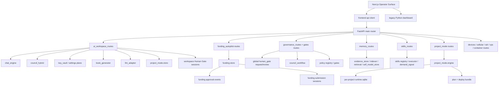

# CODEX AEIS DEPENDENCY GRAPH

**Status:** wersja robocza 0.1  
**Cel pliku:** pokazac realne zaleznosci miedzy glownymi planes AEIS na podstawie kodu i probe runtime

## 1. Glowny graf logiczny

## 2. Zaleznosci najwyzszego znaczenia

### 2.1. `router.py` jest realnym control plane

`src/sylion-pipeline/sylion/api/router.py` montuje:

- governance
- memory
- skills
- workspace
- project_mode
- funding
- lab modules
- observability
- workers

Wniosek:

- glowny backend jest federatorem wielu subsystemow
- to nie jest monolit jednej liniowej sciezki AEIS

### 2.2. `ai_workspace_routes.py` zalezy od wielu rdzeni jednoczesnie

`workspace` nie jest cienkim routerem. Zalezy od:

- `chat_engine`
- `council_hybrid`
- `key_vault`
- `book_generator`
- `llm_adapter`
- `project_mode.store`

Wniosek:

- `workspace` jest dzis najblizszy warstwie Planning + Operator + Council
- dlatego to on jest glownym kandydatem na przyszly spine AEIS

### 2.3. `project_mode.engine` tworzy osobny runtime plane

`project_mode.engine` i `project_mode.store` razem daja:

- execution plan
- worker registry
- assignments
- deployment bundle
- per-project runtime DB

Wniosek:

- wykonanie projektu nie siedzi w globalnym memory plane
- siedzi w osobnym plane projektu

### 2.4. Funding jest domena z wlasnym store i wlasnym gate

`funding_autopilot` ma:

- osobny store
- submission sessions
- approval events
- audit events

Wniosek:

- funding nie jest cienkim consumerem globalnego governance
- funding ma lokalne governance i lokalny workflow

### 2.5. Governance i workspace dziela funkcje, ale nie plane

Globalne governance daje:

- `gates/human/requests`
- policies
- governance gates
- council workflow

Workspace daje:

- `workspace/humangate/sessions`
- tree/history/current
- council sessions
- project kickoff / approvals / launch

Wniosek:

- obie strony dotykaja podobnych idei kanonicznych
- ale dependency graph pokazuje dwa osobne planes operacyjne

## 3. Miejsca splitu, ktore trzeba sledzic w dalszym audycie

### 3.1. Human Gate split

Split:

- `workspace/humangate/*`
- `gates/human/requests*`

Ryzyko:

- dwa audit trail
- dwa zrodla prawdy decyzji

### 3.2. Memory split

Split:

- globalne `memory/*`
- lokalne `runtime.sqlite` w `src/results/projects/*`

Ryzyko:

- retrieval i learning beda widziec inny stan niz projekt runtime

### 3.3. Funding split

Split:

- lokalny `funding approval_event`
- globalny `Human Gate`

Ryzyko:

- decyzje prawnie lub operacyjnie istotne nie trafia do jednej warstwy operator truth

### 3.4. Operator split

Split:

- Next.js operator surface
- legacy dashboard Python

Ryzyko:

- rozjechane nav, statusy i surfaces

## 4. Wniosek

Najuczciwszy dependency graph AEIS na teraz nie jest grafem jednego eleganckiego pipeline'u.

To jest graf federacyjny:

- jeden duzy router
- bardzo silny `workspace` plane
- osobny `project_mode` runtime plane
- osobne subsystemy `memory`, `skills`, `funding`
- osobne governance plane globalne i projektowe
- dwa surface'y operatorskie

To wlasnie ten graf federacyjny trzeba potem domknac w masterplanie naprawczym do postaci jednego, produkcyjnego AEIS spine.

